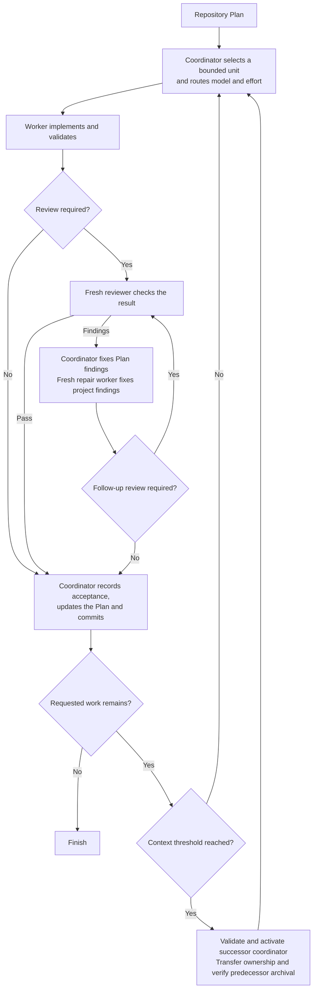

# Scoville Suite

Scoville gives planning, research, code, design and writing their own Skills.
Use the ones your task needs. Installing a family does not make every task a
family gathering.

This monorepo keeps their sources and development together. Shared helpers and
README blocks have one maintained source, and builds produce self-contained
packages. Individual Skills can be installed separately, except Workflow,
which is available only through this suite.

Workflow is a Codex-only beta and is explained first below. Other Skills retain
their own compatibility limits.

## Scoville Workflow for Codex

**Beta.** Available for real-project testing. Host-level behavior remains under qualification.

Scoville Workflow supports structured, AI-assisted software development. It is
built for extending and maintaining projects over time, including larger
codebases. Fast vibe coding and throwaway prototyping are not its intended use.

A long implementation task can leave one agent planning, coding, reviewing its
own changes and remembering every earlier decision. The conversation grows,
unfinished work becomes harder to track, and a confident summary can hide the
gap between what was requested and what was actually checked.

Scoville Workflow coordinates a repository-owned Scoville Plan through normal
Codex project tasks. Workers implement, fresh reviewers check material changes,
and one coordinator updates the Plan and commits accepted work. The suite's
specialist Skills keep their own activation rules and responsibilities.

Plan, Code and Workflow address different parts of that work. Plan preserves
scope, decisions and progress. Code requires changes to respect the existing
implementation and checks whether the requested behavior actually works.
Workflow coordinates execution, independent review and continuation. Together,
they support maintainable changes across a larger project without asking one
conversation to carry its entire history. They do not replace engineering
judgment or guarantee that a change is safe.

The coordinator gives each worker a bounded assignment and selects its model
and reasoning effort from the task's risk. The repository Plan holds progress
and decisions, so continuation does not depend on retelling the conversation.
A fresh reviewer checks changes without being the agent that wrote them.
Context handoffs let long work continue in a new task, while explicit write
ownership keeps coordination and implementation from competing in the checkout.

That separation costs tokens and time. Extra tasks need instructions, reviews
repeat some inspection, and handoffs add coordination. Workflow is intended for
sustained software development through a Plan. A small direct fix usually does
not need this machinery.

Workflow is available only as part of Scoville Suite, not from a separate
repository. It requires Codex desktop and native task controls. Other suite
Skills have their own host requirements.



**Review and repairs.** Code and critical documentation changes get a fresh
reviewer. Routine changes can skip review when a short check confirms that the
result matches the worker's report. The coordinator corrects the Plan. A repair
worker corrects the project. Material changes or unclear results get another
review. If three repair workers cannot resolve the findings, the workflow asks
you how to proceed. Failed checks and open decisions are not accepted work.

**Context handoffs.** Long tasks can continue in a fresh task before the current
context fills up. The defaults are configurable:

- **Coordinator: at or above 33%.** Check after a work unit has been accepted
  and committed. If more requested work remains, a new coordinator takes over
  using the repository Plan and a compact handoff.
- **Workers, reviewers and repair workers: above 66%.** Check at a natural
  stopping point while work remains. A successor keeps the same role, model
  and assignment, and continues in the same checkout. This is a continuation,
  not another repair attempt.

These percentages measure current context use, not total tokens spent. Missing
or stale measurements are not guessed. Completed work needs no successor, and
an explicit stop does not start another coordinator.

**Task cleanup.** Results are saved before finished tasks are archived. During
a coordinator handoff, the old coordinator gives up write access before the
new one takes over. Codex must confirm archival for the exact task. If that
confirmation is missing but safe continuation is verified, work continues and
the old coordinator stays open for later cleanup.

## Scoville Code Anti-AI-Slop

A coding agent can finish the wrong thing quite thoroughly. The tests are green,
the report sounds certain, but the behavior you asked for is still missing.

Scoville Code is the engineering foundation of the suite. Before substantial
editing, it requires the agent to establish what must work, which existing code
owns that behavior, what the change could break and which check would expose
that failure. Those answers guide the work. They are not another form to fill in.

The rules require the agent to:

- **Find the cause before patching the symptom.** Read the responsible code and
  the relevant callers, contracts and tests. Expand the search only when the
  evidence points elsewhere.
- **Fix the existing implementation.** Keep behavior in its established owner
  instead of adding a parallel path, speculative abstraction or unrelated
  cleanup. Preserve the project's conventions and your unfinished changes.
- **Test the claim, not just the code.** Choose a check that could reveal the
  reported defect or the failure the change might introduce. A passing mock
  does not prove an integration that the mock replaced.
- **Investigate failures.** Do not call a failing test pre-existing without
  evidence, or weaken its assertions to get green output. If two corrections
  fail on the same underlying problem, reread the cause and change the approach.
- **Report what was actually verified.** A successful build is not a working
  user flow. Missing evidence stays visible, and required acceptance checks
  remain open when they cannot run.

The point is to connect the requested result, the implementation and the proof.
Each constrains the next. That makes it harder to substitute plausible code,
busywork or a confident completion message for the behavior you asked for.
It also limits unnecessary work. Once the changed behavior and its material
risks have decisive evidence, more searching and testing need a concrete reason.

Reading the relevant code and checking the result can use more tokens and time
than producing an immediate patch. The rules keep that cost tied to the actual
change, rather than requiring a full audit for every edit.

Use it for implementation, diagnosis, review and removal of code or engineering
artifacts. It can investigate without editing. Small changes should stay small,
while migrations, security boundaries and irreversible work need closer checks.

## Scoville Plan

A useful plan lets you pick up the work again without reconstructing the whole
conversation. It says what is active, which decisions apply and what needs to
happen next. If maintaining the plan becomes most of the work, the structure
is getting in the way.

Scoville Plan keeps Plans, Work Items and Decisions in the repository. Use it
when work spans dependent outcomes, needs explicit decisions or must survive
interruption. It preserves the existing planning owner and keeps completion
tied to an observed result, rather than the presence of a file or a checked box.
The agent records the active work, relevant decisions, evidence and next action
where the next session can find them. Updating these records takes time and
tokens. Small reversible changes usually need no durable Plan.

## Scoville Scribe Anti-AI-Slop

A rewrite can sound better and say something different. "May reduce latency"
becomes "will improve performance", or a summary drops the condition that made
the result true. Smooth prose does not repair a changed claim.

Scoville Scribe drafts, edits, summarizes, localizes and audits requested text.
It preserves meaning, evidence, attribution, terms and behavior while removing
filler and unclear wording. Explanations must introduce their concepts,
identify what they refer to and give the reader enough information to act.

The agent checks the revision against the source's claims and qualifications,
then asks whether the reader can follow the explanation without supplying
missing knowledge. That comparison adds reading and revision work, especially
for source-sensitive text. It does not make unsupported claims true.

Use it for articles, reports, help, interface text and exact-source work.
Ordinary answers and status updates do not activate it merely because they
contain prose. When Scoville Plan applies, Plan owns its own records, including
wording audits. Neither Skill requires the other.

## Scoville UI Anti-AI-Slop

A good desktop screenshot does not tell you whether someone can use the page.
The main action may disappear on mobile, keyboard focus may be missing, or an
error may leave the user with no way forward.

Scoville UI helps implement and audit interfaces through the framework and
design system the product already uses. It covers components, interaction
states, responsive behavior and accessibility, then asks for evidence from the
actual rendered interface.

The agent must connect implementation choices to the existing components and
check the affected states and layouts, rather than treating a successful build
as visual proof. Browser checks and corrections take additional time and tokens.
Without access to the rendered interface, that part of the result stays unverified.

When Scoville Design is active, UI implements its design decisions. Otherwise
it can develop a bounded direction for a new interface. Backend-only work and
wording alone do not activate it.

## Scoville WordPress UI Backend Anti-AI-Slop

A plugin settings page can look tidy and still fight WordPress. Native controls
get rebuilt, a second spacing scale appears, and React is treated as proof that
the page uses WPDS. None of those choices follows from the task.

Scoville WordPress UI Backend implements and audits plugin-owned `wp-admin`
interfaces through the WordPress layer that actually owns them. It covers
Classic PHP pages, Core Components and supported mixed runtimes, with explicit
rules for spacing, responsive behavior, states, accessibility and i18n.

The agent first identifies the supported WordPress runtime, then uses its
components and spacing rules instead of inventing a second UI system. It checks
the rendered page, including vertical flow and smaller screens. This needs more
inspection and validation than styling from a screenshot, and meaningful visual
checks need a running WordPress environment.

It owns implementation and UI acceptance for those surfaces. Scoville UI does
not run a second acceptance process. Frontends, the editor canvas and extensions
inside Core screens remain outside this Skill's scope.

## Scoville Design Anti-AI-Slop

A design can look polished and still miss the brief. An 80s reference becomes
neon, chrome and VHS noise, but the combination says little about the actual
subject. Or every element is neatly spaced, yet nothing tells the reader where
to start.

Scoville Design connects the visual choices to the content, audience and medium.
It helps create a direction, develop it into an artifact, inspect the result and
repair specific problems. A critique should explain what is wrong and why,
while preserving the parts that work.

The agent has to explain how typography, composition and visual references serve
the brief, then inspect the artifact and make targeted corrections. This adds
critique and revision time, and generated variants can add token or image costs.
More iterations are not useful when they no longer resolve a concrete problem.

Use it for graphic, editorial, brand, advertising, packaging, wayfinding, web,
interface, information and motion design. It also handles style interpretation.
Mechanical edits to a settled design, conversion or rendering alone, backend
work and prose-only editing do not need it.

## Scoville Handoff

The next session needs enough information to continue the work. A long account
of the conversation can still miss the current blocker, the uncommitted changes
or the reason an earlier approach failed.

Scoville Handoff turns active work into one compact continuation prompt. It
preserves the objective, decisions, permissions, file ownership, observed
results and next safe action. A test that is still running stays unresolved.
Changes belonging to the user remain identifiable.

The agent reads the named task sources and separates the objective, current
state and resume steps into a fixed structure. Preparing it costs a little
extra reading and tokens. It cannot recover facts that were never recorded or
turn an unfinished check into a result.

Request it when you want to transfer work to another agent or session. Ordinary
summaries, low context and ending a conversation do not activate it.

## Scoville Research

A source list can look convincing while the answer rests on very little. Five
articles may repeat the same press release. A real citation may concern the
right topic without supporting the sentence attached to it.

Scoville Research follows claims back to the evidence that can answer the
question. It covers current web research, GitHub-first implementation discovery,
academic literature and longer investigations that need saved records. It
keeps contradictions and gaps visible and stops when another search would no
longer change the decision.

The agent must inspect what a source actually supports, compare conflicting
evidence and keep each conclusion within those limits. Searching and reading
several sources costs more time and tokens than a quick answer. Access gaps and
inconclusive evidence remain visible instead of being filled with certainty.

Use it for questions that need several sources examined together. A summary of
one known page or paper, ordinary repository inspection, brainstorming,
implementation or wording work belongs with the corresponding task.

## Scoville Brainstorm

Three versions of the same idea do not give you three useful choices. A queue,
an event queue and a queue with different arrows may still solve the problem
in exactly the same way.

Scoville Brainstorm explores alternatives by how they work. It compares them
against the fixed constraints and existing approaches, challenges their weak
assumptions and returns a shortlist you can make a decision from. It stops
before choosing or implementing a direction.

The agent develops candidate mechanisms separately before comparing them, so
the first plausible idea does not define every alternative. Exploration and
comparison add tokens and time, and a shortlist still needs a decision and
validation. A claim of originality is limited to what was actually examined.

Use it for architecture, product, workflow or research questions that need
materially different approaches, including competing explanations for an unknown
cause. A known fix, ordinary review or wording question does not need this process.

## Install the suite

Use one request in your agent host:

```text
Install all Scoville Skills compatible with this host for all my projects from
https://github.com/benjaminstelzer/scoville-suite/tree/main/packages
Each packages/<name>/<name>/ directory contains one installable Skill.
Inspect each Skill's compatibility first. Workflow requires Codex desktop.
Preserve personal configuration and unrelated installed Skills. Do not install
members/, development/, or another copy from the individual repositories.
Report installed locations, skipped incompatibilities and discovery results.
```

The suite supplies all its Skills from one repository. Your host still sees
separate Skills, so you can enable or disable them individually. Workflow is
suite-only. The specialist Skills are also available from their individual repositories.

If your host cannot fetch or install them, copy each compatible inner Skill
directory to its documented Skills location. See the
[Codex Skills guide](https://developers.openai.com/codex/skills/) or
[Claude Code Skills guide](https://code.claude.com/docs/en/skills).

## Development and builds

Edit member sources under `members/`. Edit README fragments under
`development/readme/` and their ordered paths in `suite.json`. Member README
files are generated previews, not a second authoring source.

An isolated clone builds from the shared tools and templates bundled under
`development/shared/`. In the authoring workspace, the sibling `shared/`
directory owns those sources and supplies both suites. Installed Skills use
only the helpers inside their own package.

The shared Development block appears in this suite and its member previews.
Individual releases omit it. Maintain its source, test and note paths in each
member's `development` metadata in `suite.json`.

Regenerate previews with `python development/build_suite.py --write-readmes`.
Use `--check-readmes` to detect stale previews.

Build to a new directory outside this repository:

```text
python development/build_suite.py --output <new-output-directory> --public-only
```

Omit `--public-only` only for private local staging. Each output directory
contains the member package, README, license and changelog where supplied.
Development files stay in the suite. The build receipt records file hashes,
target visibility and the source revision. An uncommitted source produces a
local development build, not a release candidate.

Standalone members use their individual repositories. Workflow is suite-only
and is staged under `scoville-suite/packages/scoville-workflow-for-codex/`.
Its installable Skill is the nested `scoville-workflow-for-codex/` directory.
Publication requires a separate authorized publication step with the
GitHub Skill. Never push a private suite tree to a public member repository.

### Developer links

Sources, tests and notes stay in this suite. Individual packages omit this block
and the development files.

- **scoville-code-anti-ai-slop**: [Source](https://github.com/benjaminstelzer/scoville-suite/tree/main/members/scoville-code-anti-ai-slop) | [Tests](https://github.com/benjaminstelzer/scoville-suite/tree/main/members/scoville-code-anti-ai-slop/development/tests) | [Notes](https://github.com/benjaminstelzer/scoville-suite/blob/main/members/scoville-code-anti-ai-slop/development/README.md)
- **scoville-plan**: [Source](https://github.com/benjaminstelzer/scoville-suite/tree/main/members/scoville-plan) | [Tests](https://github.com/benjaminstelzer/scoville-suite/tree/main/members/scoville-plan/development/tests) | [Notes](https://github.com/benjaminstelzer/scoville-suite/blob/main/members/scoville-plan/development/README.md)
- **scoville-scribe-anti-ai-slop**: [Source](https://github.com/benjaminstelzer/scoville-suite/tree/main/members/scoville-scribe-anti-ai-slop) | [Tests](https://github.com/benjaminstelzer/scoville-suite/tree/main/members/scoville-scribe-anti-ai-slop/development/tests) | [Notes](https://github.com/benjaminstelzer/scoville-suite/blob/main/members/scoville-scribe-anti-ai-slop/development/README.md)
- **scoville-ui-anti-ai-slop**: [Source](https://github.com/benjaminstelzer/scoville-suite/tree/main/members/scoville-ui-anti-ai-slop) | [Tests](https://github.com/benjaminstelzer/scoville-suite/tree/main/members/scoville-ui-anti-ai-slop/development/tests) | [Notes](https://github.com/benjaminstelzer/scoville-suite/blob/main/members/scoville-ui-anti-ai-slop/development/README.md)
- **scoville-wordpress-ui-backend-anti-ai-slop**: [Source](https://github.com/benjaminstelzer/scoville-suite/tree/main/members/scoville-wordpress-ui-backend-anti-ai-slop) | [Tests](https://github.com/benjaminstelzer/scoville-suite/blob/main/development/luna-tests/wordpress-sol-results.md) | [Notes](https://github.com/benjaminstelzer/scoville-suite/blob/main/members/scoville-wordpress-ui-backend-anti-ai-slop/development/README.md)
- **scoville-design-anti-ai-slop**: [Source](https://github.com/benjaminstelzer/scoville-suite/tree/main/members/scoville-design-anti-ai-slop) | [Tests](https://github.com/benjaminstelzer/scoville-suite/tree/main/members/scoville-design-anti-ai-slop/development/tests) | [Notes](https://github.com/benjaminstelzer/scoville-suite/blob/main/members/scoville-design-anti-ai-slop/development/README.md)
- **scoville-handoff**: [Source](https://github.com/benjaminstelzer/scoville-suite/tree/main/members/scoville-handoff) | [Tests](https://github.com/benjaminstelzer/scoville-suite/tree/main/members/scoville-handoff/development/tests) | [Notes](https://github.com/benjaminstelzer/scoville-suite/blob/main/members/scoville-handoff/development/README.md)
- **scoville-research**: [Source](https://github.com/benjaminstelzer/scoville-suite/tree/main/members/scoville-research) | [Tests](https://github.com/benjaminstelzer/scoville-suite/tree/main/members/scoville-research/development/tests) | [Notes](https://github.com/benjaminstelzer/scoville-suite/blob/main/members/scoville-research/development/README.md)
- **scoville-brainstorm**: [Source](https://github.com/benjaminstelzer/scoville-suite/tree/main/members/scoville-brainstorm) | [Tests](https://github.com/benjaminstelzer/scoville-suite/tree/main/members/scoville-brainstorm/development/tests) | [Notes](https://github.com/benjaminstelzer/scoville-suite/blob/main/members/scoville-brainstorm/development/README.md)
- **scoville-workflow-for-codex**: [Source](https://github.com/benjaminstelzer/scoville-suite/tree/main/members/scoville-workflow-for-codex) | [Tests](https://github.com/benjaminstelzer/scoville-suite/tree/main/members/scoville-workflow-for-codex/development/tests) | [Notes](https://github.com/benjaminstelzer/scoville-suite/blob/main/members/scoville-workflow-for-codex/development/README.md)

