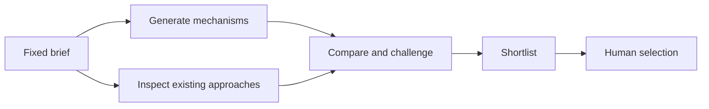

## How it works

- Check that the request needs materially different mechanisms, then freeze the factual brief and constraints.
- Generate candidates separately from landscape research and criticism when the host supports independent agents.
- Without delegation, use one generation pass and one landscape pass, and state that independence was unavailable.
- Group surface variants by mechanism, challenge weak assumptions and compare against inspected approaches.
- Return up to three directions, or two in Compact mode, with benefits, risks and cheap falsifiers. Stop before selection or implementation.

