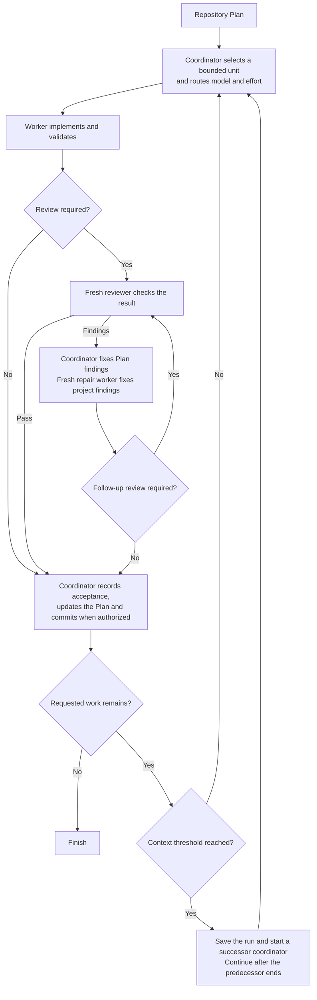

## How it works

- The calling task coordinates directly and selects one Plan Step, or a Work Item without Steps, and routes its model and reasoning effort by risk. Workers implement in the existing checkout.
- Fresh reviewers check code and critical documentation changes. Routine changes can skip review after a bounded consistency check.
- The coordinator corrects Plan findings. Repair workers correct project findings, with further review when changes are material or unclear.
- With existing commit authority, accepted work and Plan updates enter one commit. Failed checks and open decisions do not count as acceptance.
- At an accepted boundary with more work remaining, the coordinator hands over at or above 25% context use. Workers, reviewers and repairs hand over above 75% at natural stopping points.
- Both thresholds are configurable and measure current context, not total tokens spent. Missing or stale measurements are not guessed.
- A successor retains the assignment and checkout. A context handoff is not another repair attempt. Results are saved before exact-task archival. Archive errors are reported without blocking accepted work.

