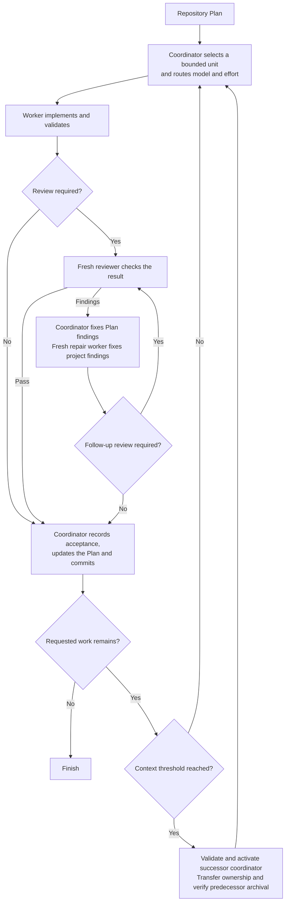

# Scoville Workflow for Codex

{{ var: release_notice }}

A plan needs someone to keep it moving. It does not need that someone to do
every job as well.

Scoville Workflow coordinates a repository-owned Scoville Plan through normal
Codex project tasks. Workers implement, fresh reviewers check material changes,
and one coordinator updates the Plan and commits accepted work. The suite's
specialist Skills keep their own activation rules and responsibilities.

Workflow is available only as part of Scoville Suite, not from a separate
repository. It requires Codex desktop and native task controls. Other suite
Skills have their own host requirements.

Code and critical documentation changes require review. Routine changes can
skip it after a bounded consistency check. Findings go to their actual owner,
so a Plan correction does not need a repair worker. Material or unclear
corrections require another review. After three repair workers, unresolved
project findings require your decision instead of a fourth attempt.
The diagram follows completed work. Blockers, failed checks and unresolved
decisions do not count as acceptance. Finished child tasks are archived only
after their results have been retained, with confirmation for the exact task.

The context check happens after an accepted unit, not halfway through work.
Its configurable coordinator threshold defaults to 33 percent. A successor
continues from the repository Plan and a compact handoff. The old coordinator
loses write ownership before the new one takes over. Archival requires separate
host confirmation. If that proof is missing but safe continuation is verified,
the predecessor stays open for later cleanup. Missing context measurements are
not guessed. A stop or completed scope creates no successor.
