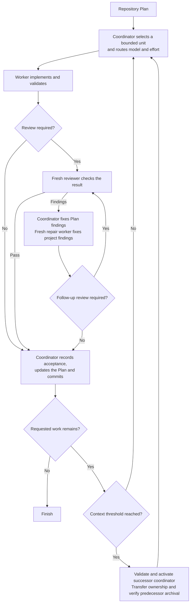

# Scoville Workflow for Codex

Scoville Workflow supports structured, AI-assisted software development. It is
built for extending and maintaining projects over time, including larger
codebases. Fast vibe coding and throwaway prototyping are not its intended use.

A long implementation task can leave one agent planning, coding, reviewing its
own changes and remembering every earlier decision. The conversation grows,
unfinished work becomes harder to track, and a confident summary can hide the
gap between what was requested and what was actually checked.

Scoville Workflow coordinates a repository-owned Scoville Plan through normal
Codex project tasks. Workers implement, fresh reviewers check material changes,
and one coordinator updates the Plan and commits accepted work. The suite's
specialist Skills keep their own activation rules and responsibilities.

Plan, Code and Workflow address different parts of that work. Plan preserves
scope, decisions and progress. Code requires changes to respect the existing
implementation and checks whether the requested behavior actually works.
Workflow coordinates execution, independent review and continuation. Together,
they support maintainable changes across a larger project without asking one
conversation to carry its entire history. They do not replace engineering
judgment or guarantee that a change is safe.

The coordinator gives each worker a bounded assignment and selects its model
and reasoning effort from the task's risk. The repository Plan holds progress
and decisions, so continuation does not depend on retelling the conversation.
A fresh reviewer checks changes without being the agent that wrote them.
Context handoffs let long work continue in a new task, while explicit write
ownership keeps coordination and implementation from competing in the checkout.

That separation costs tokens and time. Extra tasks need instructions, reviews
repeat some inspection, and handoffs add coordination. Workflow is intended for
sustained software development through a Plan. A small direct fix usually does
not need this machinery.

Workflow is available only as part of Scoville Suite, not from a separate
repository. It requires Codex desktop and native task controls. Workflow execution has been tested in Codex. For other suite members, check
their individual host requirements and test evidence.

**Review and repairs.** Code and critical documentation changes get a fresh
reviewer. Routine changes can skip review when a short check confirms that the
result matches the worker's report. The coordinator corrects the Plan. A repair
worker corrects the project. Material changes or unclear results get another
review. If three repair workers cannot resolve the findings, the workflow asks
you how to proceed. Failed checks and open decisions are not accepted work.

**Context handoffs.** Long tasks can continue in a fresh task before the current
context fills up. The defaults are configurable:

- **Coordinator: at or above 33%.** Check after a work unit has been accepted
  and committed. If more requested work remains, a new coordinator takes over
  using the repository Plan and a compact handoff.
- **Workers, reviewers and repair workers: above 66%.** Check at a natural
  stopping point while work remains. A successor keeps the same role, model
  and assignment, and continues in the same checkout. This is a continuation,
  not another repair attempt.

These percentages measure current context use, not total tokens spent. Missing
or stale measurements are not guessed. Completed work needs no successor, and
an explicit stop does not start another coordinator.

**Task cleanup.** Results are saved before finished tasks are archived. During
a coordinator handoff, the old coordinator gives up write access before the
new one takes over. Codex must confirm archival for the exact task. If that
confirmation is missing but safe continuation is verified, work continues and
the old coordinator stays open for later cleanup.
