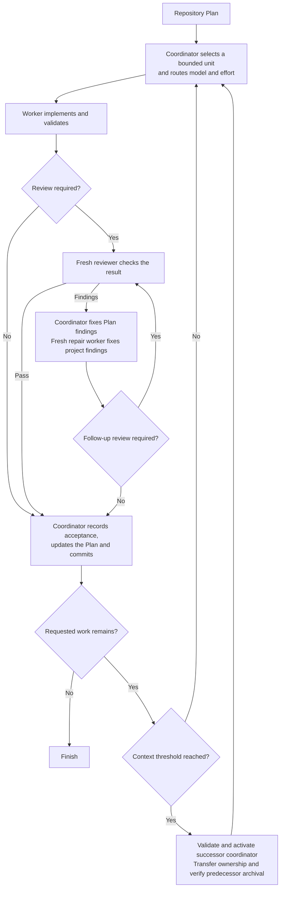

# Scoville Workflow for Codex

A long software task can leave one agent planning, coding, reviewing its own
changes and remembering every earlier decision. Context grows while unfinished
work becomes harder to track.

Scoville Workflow supports structured, AI-assisted software development and
long-term project maintenance, including larger codebases. It is not intended
for fast vibe coding or throwaway prototyping. Plan preserves direction and
decisions, Code requires maintainable changes and meaningful checks, and Workflow
coordinates workers, fresh reviewers and continuation. Together they help keep
project development recoverable without making one conversation carry its history.

**Beta.** Available for real-project testing. Host-level behavior remains under qualification.

Workflow is suite-only and requires Codex desktop with native task controls.
Other suite Skills should work with many Agent Skills-compatible hosts, subject
to their requirements. Testing has been limited to Codex, Claude Code and Antigravity.

## How it works

- The coordinator selects a bounded Plan unit and routes its model and reasoning effort by risk. Workers implement in the existing checkout.
- Fresh reviewers check code and critical documentation changes. Routine changes can skip review after a bounded consistency check.
- The coordinator corrects Plan findings. Repair workers correct project findings, with further review when changes are material or unclear.
- Accepted work and Plan updates enter one commit. Failed checks and open decisions do not count as acceptance.
- At an accepted boundary with more work remaining, the coordinator hands over at or above 33% context use. Workers, reviewers and repairs hand over above 66% at natural stopping points.
- Both thresholds are configurable and measure current context, not total tokens spent. Missing or stale measurements are not guessed.
- A successor retains the assignment and checkout. A context handoff is not another repair attempt. Results are saved before exact-task archival is confirmed.



## What it enforces

- **Explicit activation.** Asking for implementation or delegation alone does not start Workflow.
- **Separate responsibilities.** The coordinator owns Plan updates, dispatch and accepted commits. Workers implement. Reviewers stay read-only.
- **One live checkout.** Tasks use the existing working state. Workflow does not create an isolated worktree without an explicit choice.
- **Cooperative write ownership.** A project guard grants one worker a bounded unit. Invalid state stops writes. This coordinates agents, not a filesystem lock against external tools.
- **Complete but bounded context.** Dispatch includes the selected Plan unit and its Decisions without truncation. Workers do not reconstruct it from a summary or reopen the Plan.
- **Configured routing.** Risk selects the model and effort. Unsupported required pairs block rather than silently falling back.
- **Independent review where needed.** Code and critical documentation changes require a fresh reviewer. Unresolved worker findings allow at most three repair workers before user input is required.
- **Measured rollover.** By default, the coordinator hands over at or above 33 percent after an accepted unit. Child roles hand over strictly above 66 percent at a natural boundary. Missing or stale measurements are not guessed. Both thresholds are configurable.
- **Verified cleanup.** Results are retained before children are archived. A rollover successor takes ownership before archiving its predecessor, whose turn must have ended. Exact task IDs matter, not titles or list visibility alone.
- **Accepted work before commit.** One unit commit includes its accepted changes and complete accumulated Plan state. Failed hooks and outstanding backup requirements are not bypassed.
- **A binding scope.** Without a narrower boundary, continue through the active Plan. Preserve explicit stops and decisions. Archiving a task is not cancelling it.

- The canonical Plan owns progress. Workflow does not add a persistent Codex goal or another continuation loop alongside its coordinator.

- For delivery recovery, permission boundaries and failure handling, see [Native Codex operations](https://github.com/benjaminstelzer/scoville-suite/blob/main/packages/scoville-workflow-for-codex/scoville-workflow-for-codex/references/operations.md).

## What it costs

- Separate worker and reviewer tasks, context handoffs and Plan updates use additional tokens and time.

## How it was developed

- Workflow grew out of a CLI-based Scoville workflow whose communication and supervision added work of their own.
- The native version kept Plan ownership, routing, review and rollover, while moving execution into ordinary Codex tasks.
- Real-project histories are analyzed alongside results to identify failures and unnecessary context use.
- Targeted simulation and optimization workflows inform revisions. Changes are retained only when the required behavior survives.

- Beta testing still needs to cover automatic context compaction immediately after handoff and waiting beyond the host's maximum wait duration.

- Development links: [Source](https://github.com/benjaminstelzer/scoville-suite/tree/main/members/scoville-workflow-for-codex) | [Tests](https://github.com/benjaminstelzer/scoville-suite/tree/main/members/scoville-workflow-for-codex/development/tests) | [Notes](https://github.com/benjaminstelzer/scoville-suite/blob/main/members/scoville-workflow-for-codex/development/README.md)

## Compatibility

Requires Codex desktop, a saved local project, native task creation, waiting,
messaging and archival controls, access to the task's own `CODEX_THREAD_ID`,
and a supported Scoville Plan profile. Python 3.11+ runs the deterministic helpers.
There is no CLI or Claude Code execution path.

Tasks must share the existing checkout. If the host cannot provide that,
Workflow asks for a decision instead of silently creating another workspace.
Measured rollover uses native `token_count` data when available. Missing or
contradictory measurements do not by themselves block valid bounded work.

Native approval can hold a cross-task message pending. Workflow waits without
polling or duplicate delivery. A definite result-delivery failure still leaves
the child's validated final result available to the coordinator's recovery path.

## Install

### Install this Skill

In a local Codex session, ask:

```text
Install this Agent Skill for all my projects from this exact package directory:
https://github.com/benjaminstelzer/scoville-suite/tree/main/packages/scoville-workflow-for-codex/scoville-workflow-for-codex
Preserve existing customizations and ask before overwriting conflicting files.
Report the installed location and whether Codex discovers the Skill.
As the final installation check, create one no-tool normal project task and verify that its approval policy, access to the project root, and network access match this calling task. Archive the probe. If they differ, do not mark the Skill ready; report the exact mismatch and ask whether to apply the needed Codex configuration change.
```

The agent needs source access and permission to write to the
personal Skills location. The installable package is the nested
`scoville-workflow-for-codex/` directory, not the repository root. Manual fallback:
[Codex Skills guide](https://learn.chatgpt.com/docs/build-skills).

### Install the complete Scoville suite

Get the complete suite from the
[Scoville Suite monorepo](https://github.com/benjaminstelzer/scoville-suite).
Install its released Skill packages, not development templates.

## How to use

Activate the workflow explicitly:

```text
Use $scoville-workflow-for-codex to execute the active Scoville Plan in this saved project.
```

Name a Work Item or end boundary to limit the run. Without one, the coordinator
continues through the active Plan.

The first activation may ask to install or update the managed project
`AGENTS.md` block. After that decision, activate again to start the coordinator.
The launcher ends once it has handed over. It does not become a second supervisor.

`$scw` is recognized after loading the Skill, but native short-name discovery
is not yet verified. Use the full name for installation checks.
`scoflow codex` is also accepted. Ordinary requests such as “implement the plan”
or “use workers” do not activate Workflow.

Task titles identify the work and role:

```text
SCW PLAN-0001 W-001/step-1 WORK RUN [#1]
SCW PLAN-0001 W-001/step-1 REVIEW RUN [#1]
SCW PLAN-0001 W-001/step-1 REPAIR RUN [#2]
```

### Routing

The coordinator classifies each fresh dispatch unit and maps its effective route
to one executor pair. The reviewer pair is used only when the material-change
review gate requires review.

| Route | Typical task | Executor | Reviewer |
| --- | --- | --- | --- |
| `coordinator` | Workflow coordination | `gpt-6-sol` / `medium` | Not applicable |
| `ultra_low` | Simple bounded local change with trivial verification | `gpt-6-sol` / `low` | `gpt-6-sol` / `medium` |
| `low` | Nontrivial local judgment with one known owner, understood helpers, and established checks | `gpt-6-sol` / `medium` | `gpt-6-sol` / `high` |
| `medium` | Unresolved helpers, diagnostic discovery, interacting owners, harness boundaries, or interpreted checks | `gpt-6-sol` / `high` | `gpt-6-sol` / `xhigh` |
| `high` | Consequential changes to state, authorization, or integration contracts | `gpt-6-sol` / `xhigh` | `gpt-6-astra` / `high` |
| `ultra_high` | Unusually consequential or complex work beyond `high` | `gpt-6-astra` / `high` | `gpt-6-astra` / `xhigh` |

`low` is fail closed. The coordinator must positively know the target, single
owner, helper contracts, and exact mechanical checks, with no required discovery,
cross-language or component contract work, harness uncertainty, or interpreted
validation. One false or unknown fact raises the unit to at least `medium`.

Change these assignments in
[`scoville-workflow-for-codex/assets/workflow.toml`](scoville-workflow-for-codex/assets/workflow.toml).
The `[coordinator]`, `[execute.CLASS]`, and `[review.CLASS]` sections own model
assignments. `[context]` sets coordinator and worker rollover thresholds.
The file also contains the coordinator title. Other protocol limits remain in
the operations contract. Update this table when the published defaults change.

A Step's `[route: CLASS]` is its planned minimum. For every fresh execution
unit, the coordinator chooses the highest applicable class and raises the
effective dispatch route above an insufficient annotation, even when the task
has not changed since planning. It never dispatches below the retained
annotation. Repairs and context rollover retain their launched pair. Many files or a large known test suite alone do
not raise the class. Route, model, and reasoning are separate values; the final
route selects the configured pair before a Step-level execution override is
applied.

## Sources

- [Agent Skills specification](https://agentskills.io/specification) for the
  portable package and progressive disclosure model.
- [OpenAI coding-agent best practices](https://developers.openai.com/codex/learn/best-practices)
  for explicit outcomes, constraints, planning, and completion evidence.

## Family

- [Code](https://github.com/benjaminstelzer/scoville-code-anti-ai-slop) owns engineering scope, implementation, risk, and validation.
- [Plan](https://github.com/benjaminstelzer/scoville-plan) owns durable Plans, Work Items, Decisions, and lifecycle state.
- [Scribe](https://github.com/benjaminstelzer/scoville-scribe-anti-ai-slop) owns wording, terminology, factual meaning, and source fidelity.
- [UI](https://github.com/benjaminstelzer/scoville-ui-anti-ai-slop) owns framework-aligned implementation, interface mechanics, accessibility, and rendered evidence, with a standalone design fallback.
- [WordPress UI Backend](https://github.com/benjaminstelzer/scoville-wordpress-ui-backend-anti-ai-slop) owns plugin-owned WordPress admin interfaces, platform components, spacing, accessibility and internationalization.
- [Design](https://github.com/benjaminstelzer/scoville-design-anti-ai-slop) owns visual definition, art direction, design systems, critique, and repair.
- [Handoff](https://github.com/benjaminstelzer/scoville-handoff) transfers active work to another agent or session.
- [Research](https://github.com/benjaminstelzer/scoville-research) turns web, GitHub, and scholarly evidence into a decision-ready, claim-traceable result.
- [Brainstorm](https://github.com/benjaminstelzer/scoville-brainstorm) explores materially different mechanisms before selection.
- [Workflow Codex](https://github.com/benjaminstelzer/scoville-suite) coordinates explicit Plan execution through native Codex project tasks.

## License

MIT. See [LICENSE](LICENSE).

