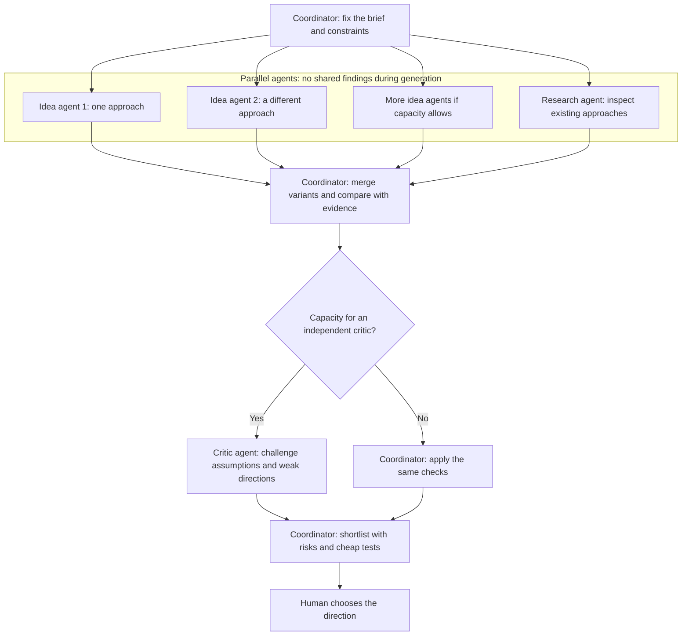

# Scoville Brainstorm

Three descriptions of the same idea do not give you three useful choices.
A queue, an event queue and a queue with different arrows may still solve the
problem in exactly the same way.

Scoville Brainstorm explores genuinely different solution mechanisms before
selection. It compares them with constraints and existing approaches, tests
their assumptions and returns a shortlist for a human decision.

## How it works

- Check that the request needs materially different mechanisms, then freeze the factual brief and constraints.
- Generate candidates separately from landscape research and criticism when the host supports independent agents.
- Without delegation, use one generation pass and one landscape pass, and state that independence was unavailable.
- Group surface variants by mechanism, challenge weak assumptions and compare against inspected approaches.
- Return up to three directions, or two in Compact mode, with benefits, risks and cheap falsifiers. Stop before selection or implementation.



## What it enforces

- **Decision-shaped activation.** Difficulty alone does not trigger an idea
  search. The request must need materially different mechanisms.
- **One factual frame.** Facts, authority, fixed constraints, assumptions,
  source scope, and effort profile are frozen before divergence.
- **Independent generation when available.** Generators do not see sibling or
  landscape output. A single-agent fallback is labeled by its real capacity.
- **One landscape owner in combined mode.** Research replaces the native
  Brainstorm landscape agent when both Skills are explicitly requested. It
  never becomes a standalone dependency.
- **Mechanisms over paraphrases.** Convergence merges surface variants and
  rejects unsupported or constraint-breaking directions.
- **Calibrated originality.** Evidence labels describe only the documented,
  bounded comparison and never claim objective novelty or patentability.
- **A hard decision stop.** The result gives benefits, risks, and cheapest
  falsifiers, then waits for human selection.

- The complete contract is in [SKILL.md](https://github.com/benjaminstelzer/scoville-brainstorm/blob/main/scoville-brainstorm/SKILL.md).

## What it costs

- Separate idea generation, comparison and critique use additional tokens and time.

## How it was developed

- I developed Brainstorm around a recurring problem: asking for different ideas often produces different descriptions of the same idea.
- The instructions keep generation separate from criticism and compare alternatives by how they work.
- That distinction matters more than the number of proposals.
- Real-project histories are analyzed alongside results to identify failures and unnecessary context use.
- Targeted simulation and optimization workflows inform revisions. Changes are retained only when the required behavior survives.

## Compatibility

Any Agent Skills host that can read references/. Isolated generators, a landscape agent and an independent critic need subagent spawning; without it the Skill uses its documented solo fallback. Web search improves the landscape pass. No scripts, no network service. Developed for Codex and Claude Code; other hosts untested.

Codex currently offers no way to close subagents and free their slots. This limits
additional parallel work within a session.

## Install

### Install this Skill

In a local Codex or Claude Code session, ask:

```text
Install this Agent Skill for all my projects from this exact package directory:
https://github.com/benjaminstelzer/scoville-brainstorm/tree/main/scoville-brainstorm
Preserve existing customizations and ask before overwriting conflicting files.
Report the installed location and whether the host discovers the Skill.
```

The agent needs source access and permission to write to its personal Skills
location. Manual fallback: [Codex Skills guide](https://learn.chatgpt.com/docs/build-skills)
or [Claude Code Skills guide](https://code.claude.com/docs/en/skills).

Install only the linked package for the focused option.

### Install the complete Scoville suite

Get the complete suite from the
[Scoville Suite monorepo](https://github.com/benjaminstelzer/scoville-suite).
Install its released Skill packages, not development templates.

## How to use

Name Scoville Brainstorm and an effort profile in the request. Compact targets
up to three generator branches, Standard up to five, and Deep six to eight when
host capacity permits. Weak ideas are never added merely to reach a count.

**Compact** - a quick check before choosing between a few plausible directions:

```text
Use Scoville Brainstorm in Compact mode. Find materially different mechanisms for reducing checkout abandonment without changing the payment provider. Preserve the stated constraints, return a short decision-ready comparison, and do not choose or implement a direction.
```

**Standard** - broader exploration with prior-art separation:

```text
Use Scoville Brainstorm in Standard mode. Explore materially different architectures for offline-first collaboration. Separate established approaches from adaptations or candidate-original directions, identify attractive traps, and stop at a shortlist with the cheapest falsifier for each direction.
```

**Deep** - a material, uncertain choice worth a wider search:

```text
Use Scoville Brainstorm in Deep mode. Investigate fundamentally different mechanisms for recovering from intermittent data corruption with an unknown root cause. Include a load-bearing-assumption challenge, a practical comparator, bounded prior-art research, and falsifiable hypotheses. Do not diagnose, plan, or implement the winner.
```

**Combined with Research** - keep evidence depth without anchoring the idea
generators:

```text
Use Scoville Brainstorm together with Scoville Research. Freeze the factual frame and generator prompts first. Let Research own one inspected prior-art landscape lane, keep that lane invisible to Brainstorm generators until convergence, and return a mechanism-level shortlist without implementing it.
```

Explicit `$scoville-brainstorm` invocation also works on hosts that support
named Skill invocation.

## Sources

- [UditAkhourii/adhd](https://github.com/UditAkhourii/adhd/tree/3d9dc487bc2eba4449742e2db0d92be9ebdf95b6)
  for isolated ideation, delayed criticism, and convergence after divergence.
- [SkillReducer](https://arxiv.org/abs/2603.29919v2) for semantic-unit analysis
  and progressive disclosure.
- [Tree of Thoughts](https://arxiv.org/abs/2305.10601v2) and
  [Brainstorm then Select](https://openreview.net/forum?id=8HwKaJ1wvl) for
  separating candidate generation from evaluation and selection.
- [Agent Skills specification](https://agentskills.io/specification) for the
  portable package contract.

## Family

- [Code](https://github.com/benjaminstelzer/scoville-code-anti-ai-slop) owns engineering scope, implementation, risk, and validation.
- [Plan](https://github.com/benjaminstelzer/scoville-plan) owns durable Plans, Work Items, Decisions, and lifecycle state.
- [Scribe](https://github.com/benjaminstelzer/scoville-scribe-anti-ai-slop) owns wording, terminology, factual meaning, and source fidelity.
- [UI](https://github.com/benjaminstelzer/scoville-ui-anti-ai-slop) owns framework-aligned implementation, interface mechanics, accessibility, and rendered evidence, with a standalone design fallback.
- [WordPress UI Backend](https://github.com/benjaminstelzer/scoville-wordpress-ui-backend-anti-ai-slop) owns plugin-owned WordPress admin interfaces, platform components, spacing, accessibility and internationalization.
- [Design](https://github.com/benjaminstelzer/scoville-design-anti-ai-slop) owns visual definition, art direction, design systems, critique, and repair.
- [Handoff](https://github.com/benjaminstelzer/scoville-handoff) transfers active work to another agent or session.
- [Research](https://github.com/benjaminstelzer/scoville-research) turns web, GitHub, and scholarly evidence into a decision-ready, claim-traceable result.
- [Brainstorm](https://github.com/benjaminstelzer/scoville-brainstorm) explores materially different mechanisms before selection.
- [Workflow Codex](https://github.com/benjaminstelzer/scoville-suite) coordinates explicit Plan execution through native Codex project tasks.

## License

MIT. See [LICENSE](LICENSE).

