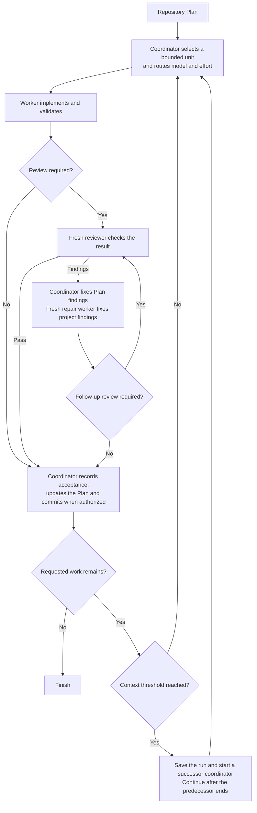

# Scoville Workflow for Codex

A long software task can leave one agent planning, coding, reviewing its own
changes and remembering every earlier decision. Context grows while unfinished
work becomes harder to track.

Scoville Workflow supports structured, AI-assisted software development and
long-term project maintenance, including larger codebases. It is not intended
for fast vibe coding or throwaway prototyping. Plan preserves direction and
decisions, Code requires maintainable changes and meaningful checks, and Workflow
coordinates workers, fresh reviewers and continuation. Together they help keep
project development recoverable without making one conversation carry its history.

**Beta.** Available for real-project testing. Host-level behavior remains under qualification.

Workflow is suite-only and requires Codex desktop with native task controls.
Workflow execution has been tested in Codex. For other suite members, check
their individual host requirements and test evidence.

## How it works

- The calling task coordinates directly and selects one Plan Step, or a Work Item without Steps, and routes its model and reasoning effort by risk. Workers implement in the existing checkout.
- Fresh reviewers check code and critical documentation changes. Routine changes can skip review after a bounded consistency check.
- The coordinator corrects Plan findings. Repair workers correct project findings, with further review when changes are material or unclear.
- With existing commit authority, accepted work and Plan updates enter one commit. Failed checks and open decisions do not count as acceptance.
- At an accepted boundary with more work remaining, the coordinator hands over at or above 25% context use. Workers, reviewers and repairs hand over above 75% at natural stopping points.
- Both thresholds are configurable and measure current context, not total tokens spent. Missing or stale measurements are not guessed.
- A successor retains the assignment and checkout. A context handoff is not another repair attempt. Results are saved before exact-task archival. Archive errors are reported without blocking accepted work.



## What it enforces

Scoville Workflow requires a frontier LLM from the Fable, Astra, SOL or Opus
families, version 5.0 or newer. Earlier policy qualification used GPT-6 SOL Medium. The simplified workflow
is undergoing fresh validation; those earlier results do not qualify this revision.

- **Explicit activation.** Asking for implementation or delegation alone does not start Workflow.
- **Separate responsibilities.** The coordinator owns Plan updates, dispatch and accepted commits. Workers implement. Reviewers stay read-only.
- **One live checkout.** Tasks use the existing working state. Workflow does not create an isolated worktree without an explicit choice.
- **Single-run operation.** One worker handles one unit at a time. The run record retains the active task and next action. Change configuration between runs and avoid parallel project edits.
- **Complete but bounded context.** Dispatch includes the selected Plan unit and its Decisions without truncation. Workers do not reconstruct it from a summary or reopen the Plan.
- **Configured routing.** Risk selects the model and effort. Unsupported required pairs block rather than silently falling back.
- **Independent review where needed.** Code and critical documentation changes require a fresh reviewer. Unresolved worker findings allow at most three repair workers before user input is required.
- **Measured rollover.** By default, the coordinator hands over at or above 25 percent after an accepted unit. Child roles hand over strictly above 75 percent at a natural boundary. Missing or stale measurements are not guessed. Both thresholds are configurable.
- **Retained results before cleanup.** Results are retained before children are archived. A rollover successor takes ownership before archiving its predecessor, whose turn must have ended. Archive by exact task ID and check the reply once. Report errors without blocking accepted work. Tasks awaiting a user decision and the final coordinator remain open.
- **Accepted work before commit.** When committing is already authorized, a unit commit includes its accepted changes and complete accumulated Plan state. Failed hooks and outstanding backup requirements are not bypassed.
- **A binding scope.** Without a narrower boundary, continue through the active Plan. Preserve explicit stops and decisions. Archiving a task is not cancelling it.

- The canonical Plan owns progress. Workflow does not add a persistent Codex goal or another continuation loop alongside its coordinator.

- For delivery recovery, permission boundaries and failure handling, see [Native Codex operations](https://github.com/benjaminstelzer/scoville-suite-for-codex/blob/main/packages/scoville-workflow-for-codex/scoville-workflow-for-codex/references/operations.md).

## What it costs

- Separate worker and reviewer tasks, context handoffs and Plan updates use additional tokens and time.

## How it was developed

- Workflow grew out of a CLI-based Scoville workflow whose communication and supervision added work of their own.
- The native version kept Plan ownership, routing, review and rollover, while moving execution into ordinary Codex tasks.
- Real-project histories are analyzed alongside results to identify failures and unnecessary context use.
- Targeted simulation and optimization workflows inform revisions. Changes are retained only when the required behavior survives.

- Beta testing still needs to cover automatic context compaction immediately after handoff and waiting beyond the host's maximum wait duration.

## Compatibility

Requires Codex desktop, a saved local project, native task creation, waiting,
messaging and archival controls, access to the task's own `CODEX_THREAD_ID`,
and Scoville Plan v1.8.0 or a compatible source_text selector. Python 3.11+ runs the deterministic helpers.
There is no CLI or Claude Code execution path.

Tasks must share the existing checkout. If the host cannot provide that,
Workflow asks for a decision instead of silently creating another workspace.
Measured rollover uses native `token_count` data when available. Missing or
contradictory measurements do not by themselves block valid bounded work.

Native approval can hold a cross-task message pending. Keep that task handle
and wait without duplicate sends. The coordinator collects results from the
exact completed task with `read_thread`, preserving the original line breaks.
The compact `wait_threads` snapshot is not the input to the result parser.
No separate result-delivery message is required.

This package requires every Skill included in this suite to be installed and
enabled. Partial installation is not supported. Skills keep their own task
scope and invocation rules; Workflow still requires an explicit request.

## Install

Install and enable the complete
[Scoville Suite for Codex](https://github.com/benjaminstelzer/scoville-suite-for-codex/tree/main/packages).
Workflow is suite-only. Every Skill must come from this repository's own
`packages/<name>/<name>/` directory. Do not substitute individual-repository
packages or continue with missing members. The suite requires Codex and
Python 3.11 or newer. Follow the suite's migration prompt for a fresh installation.

### Install the complete Scoville suite

Get the complete suite from the
[Scoville Suite monorepo](https://github.com/benjaminstelzer/scoville-suite-for-codex).
Install its released Skill packages, not development templates.

## How to use

Activate the workflow explicitly:

```text
Use $scoville-workflow-for-codex to execute the active Scoville Plan in this saved project.
```

Name a Work Item or end boundary to limit the run. Without one, the coordinator
continues through the active Plan.

The calling task coordinates the run directly. A project `AGENTS.md` addition is
optional setup on explicit request. It is not a prerequisite for execution.

`$scw` is recognized after loading the Skill, but native short-name discovery
is not yet verified. Use the full name for installation checks.
`scoflow codex` is also accepted. Ordinary requests such as “implement the plan”
or “use workers” do not activate Workflow.

Task titles identify the work and role:

```text
S-MNGR-#2-PLAN-0011
S-WORK-#3-W-010/STEP-2
S-REVW-#2-W-010/STEP-2
S-FIXR-#1-W-010/STEP-2
```

The number counts tasks separately for each role within the workflow run. A new
successor gets the next number; continuing the same task keeps its number.
The manager shows the Plan ID. Workers, reviewers and repair workers show their
assigned unit without its title. A whole Work Item has no Step suffix. Uppercase
affects display only. Rollover keeps the same logical workflow run even
though the successor's displayed number increases.

### Configuration

Save settings under `workflow` in the project's `.scoville/config.json`.
`execute.CLASS` and `review.CLASS` contain model/reasoning pairs. `context`
sets coordinator and worker rollover thresholds. Missing values come from
this Skill's imported `assets/workflow.toml`. Reading or starting creates no
configuration file. One run uses one workspace. Change settings between runs,
and do not edit the same project files in parallel while a run is working.
Concurrent edits have no automatic conflict-recovery guarantee.
Route classification, Step overrides and repair escalation follow the
[dispatch rules](scoville-workflow-for-codex/references/operations-dispatch.md).
Use Scoville Setup to display these settings or save explicit changes. It is
part of the suite and does not start workflows. Default rollover thresholds
are 25 percent for the coordinator and 75 percent for child roles. The
coordinator hands over at or above its threshold, child roles strictly above
it. The run cursor is ordinary Markdown in `.scoville/workflow.md`.

## Sources

- [Agent Skills specification](https://agentskills.io/specification) for the
  portable package and progressive disclosure model.
- [OpenAI coding-agent best practices](https://developers.openai.com/codex/learn/best-practices)
  for explicit outcomes, constraints, planning, and completion evidence.

## License

MIT. See [LICENSE](LICENSE).
